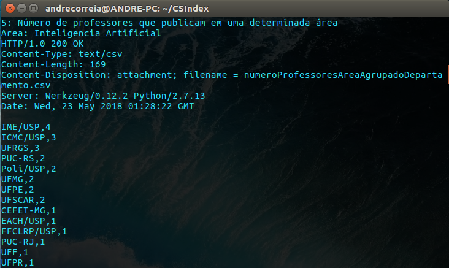

# API REST
API desenvolvida para a disciplina de Engenharia de Software 2.

## Desenvolvedores

André Correia Lacerda Mafra & Felipe Giori

## Objetivo

Esta API desenvolvida como trabalho para a disciplina de Engenharia de Software II tem como intuito facilitar a consulta
aos dados do CSIndex (Indexação da produção ciêntífica em Ciência da Computação no Brasil). Portanto a API possui somente
o método GET, ou seja apenas retorna dados do CSIndex.
Os dados são compostos de Áreas do conhecimento, Conferências, Professores, Artigos e Departamentos.

## Requisitos
Linguagem: python 2.7
As bibliotecas pandas e flask foram usadas na API. Para instalar as bibliotecas use of comandos em seu terminal: 
```
pip install pandas
pip install Flask
```
## Controle de Acesso HTTP (CORS)
A API já está configurada para funcionar com clientes que estejam hospedados em outros servidores que não o da api.

## Áreas do conhecimento
| Área | String |
| ------| :----: |
|Software Engineering|se|
|Programming Languages|pl|
|Information Systems|is|
|Human-Computer Interaction|chi|
|Computer Networks|net|
|Mobile Computing|mobile|
|Distributed Systems|ds|
|Computer Architecture & HPC|arch|
|Databases|db|
|Web & Information Retrieval|ir|
|Data Mining & Machine Learning|data|
|Artificial Intelligence|ai|
|Algorithms & Complexity|theory|
|Security & Cryptography|security|
|Computer Vision|vision|
|Formal Methods & Logic|formal|
## Funções
Os valores em negrito devem as ser entradas de uma chamada.

| Paramethers       | Method          | Path  | Format |
| ------------- |:-------------:|:-----:|:-----:|
| area, conferencia | GET | /numeroPublicacoesConferenciaArea/**area**/**conferencia** | CSV |
| area | GET | /numeroPublicacoesArea/**area** | CSV |
| area | GET | /scoreTodosDepartamentosArea/**area** | CSV |
|area, departamento|GET|/scoreDepartamentoArea/**area**/**departamento**|CSV|
|area|GET|/numeroProfessoresAreaAgrupadoDepartamento/**area**|CSV|
|area, departamento|GET|/numeroProfessoresDepartamentoArea/**area**/**departamento**|CSV|
|area|GET|/papersArea/**area**|CSV|
|area, ano|GET|/papersAreaAno/**area**/**ano**|CSV|
|area, departamento|GET|/papersAreaDepartamento/**area**/**departamento**|CSV|
|professor|GET|/papersProfessor/**professor**|CSV|

### Exemplo de execução:
Exemplo de endereço que retorna o score de todos os departamentos da área de Data mining & Machine Learning.
```
http://localhost:5000/scoreTodosDepartamentosArea/data
```
O resultado é um arquivo .csv com o seguinte conteúdo:

| Departamento | Score |
|----------|:-------:|
|ICMC/USP|7.29|
|UFMG|4.64|
|UFRJ|1.33|
|PUC-Rio|1.0|
|UFF|0.66|
|UFPE|0.66|
|PUC-PR|0.33|
|PUC-RS|0.33|
|UFCG|0.33|
|UFSCAR|0.33|
|UFSJ|0.33|
|UNIFOR|0.33|

## Retornos HTTP

Após uma requisição correta à api, as seguintes respostas podem ser recebidas :
* Sucesso : O csv requerido é retornado par ao cliente
* 404 Not Found : Caminho da URL não existente
* 500 Internal Server Error : Erro Interno do servidor
* Área Inválida : Tratamento personalizado para indicar que não foi possível ler a base de dados do CSIndex.

## Cliente

Um cliente de teste foi implementado e se encontra na pasta \api com o nome de client.sh, um shell script contendo diversas 
chamadas para todos os endpoints possíveis da api.
Para executar o cliente, basta abrir o terminal e digitar :
```
chmod +x client.sh
./client.sh
```

